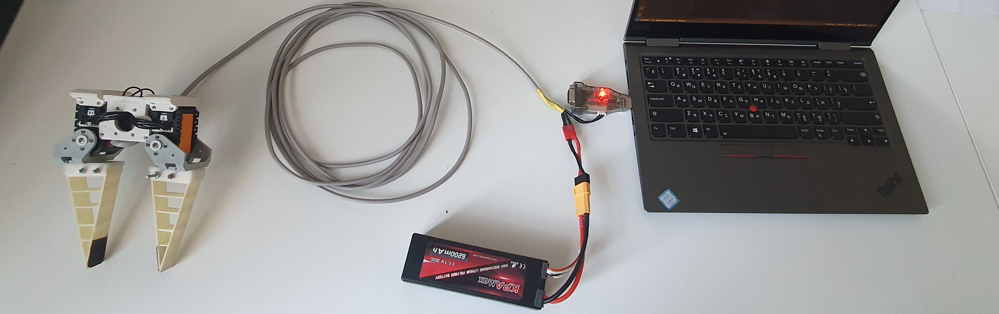

## The best gripper [two fingers version]



To assembly this one you need:

- two servomotors dynamixel AX12-type
- usb dynamixel adapter
- 3d printer
- wires

Models and so on you can find in Internet, for example this [https://hackaday.io/project/1059-adaptive-gripper](https://hackaday.io/project/1059-adaptive-gripper)

## Installation

Go to you own catkin workspace

```
roscd && cd ../src
```

Get the dynamixel SDK inside package (only you have problems with already included SDK)

```
svn export https://github.com/ROBOTIS-GIT/DynamixelSDK.git/trunk/ros/dynamixel_sdk
```

Clone this repository

```
git clone https://github.com/be2rlab/uhvat_gripper.git
```

Build it

```
catkin build
source devel/setup.bash
```

Check for the rights

```
sudo chmod a+rw /dev/ttyUSB0
```

Check the pySerial library for python (required for ros driver)

```
pip install pyserial
```

## How to use

1. Connect your gripper to power supply (or battery)
2. Connect the gripper to a usb2dynamixel adapter and a computer
3. Run the driver

```
roscore
rosrun uhvat_festolike_driver driver_node.py
```

4. Set `state`

```
rosservice call /gripper_state "state: 0"
```

where 

#### a position control

- state: 0 is a maxumum wide openning
- state: 1 is a less wide openning
- state: 2 is a more less wide openning
- state: 3 is a positions of fingers whant its touches  each other

#### a speed (lazy force) control
- state: 4 is a low level of a closing force
- state: 5 is a middle level of closing force
- state: 6 is a high level of closing force


For more details of using see `src/tests.py`.

Have a fun :)

